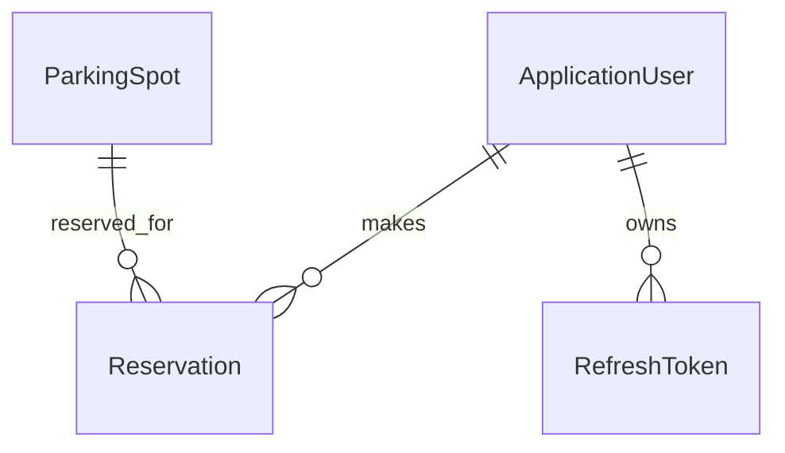

# Raknah 🚗 (ASP.NET Core Web API)

**Raknah** is a smart parking management system for booking, tracking, and managing parking spots. It enables users to find, reserve, and access parking spaces, integrates with physical gate hardware, and automates notifications for a seamless parking experience.

> **Note:** Raknah is designed for real-world parking challenges, focusing on automation, security, and ease of use for both users and administrators.

---

## 🚀 Project Vision

Raknah aims to provide a robust backend for modern parking management, enabling:

- Real-time parking spot availability and reservations
- Automated gate control via hardware integration (using HttpClient)
- User authentication and secure account management
- Reservation lifecycle management with automatic email notifications
- Admin and user roles for streamlined operations

---

## 🛡️ Professional Features

Raknah includes essential modules and best practices for a production-grade web API:

- **User Management:** Registration, login, JWT authentication
- **Parking Spot Management:** CRUD for parking spots, real-time status updates
- **Reservation System:** Book, cancel, and track reservations with automated email alerts
- **Gate Automation:** Integration with physical hardware for gate control via HttpClient
- **Background Jobs:** Automated tasks and notifications using Hangfire
- **Structured Logging:** Centralized logs with Serilog
- **Validation:** Robust server-side validation with FluentValidation
- **Repository & Unit of Work Pattern:** Clean, testable data access
- **Error Handling:** Consistent error responses and global exception management
- **Health Checks:** Endpoints for monitoring application and database health
- **Rate Limiting:** Protects APIs from abuse and overload
- **API Documentation:** OpenAPI/Swagger for easy testing and integration

---

## 🗄️ Database Design

### **Core Entities**

| Entity         | Description                                 |
| -------------- | ------------------------------------------- |
| ApplicationUser| System users (admin, user)                  |
| ParkingSpot    | Individual parking spots with status        |
| Reservation    | User reservations for parking spots         |
| RefreshToken   | For secure JWT refresh                      |

---

### **Entity Relationship Diagram (Simplified)**



---

## 📦 Project Structure

```
Raknah/
├── Abstractions/         # Core interfaces and result pattern
├── Authentications/      # JWT, Identity, and auth logic
├── Consts/               # Enums and constants
├── Contracts/            # DTOs and validation
├── Controllers/          # API endpoints
├── Entity/               # Database models
├── Errors/               # Error handling
├── Extensions/           # Helper extensions
├── Health/               # Health checks
├── Mapping/              # Mapster configurations
├── Middleware/           # Custom middleware
├── Persistence/          # DbContext, migrations, configs
├── Services/             # Business logic and background jobs
├── Settings/             # App and mail settings
├── Templates/            # Email templates
├── Program.cs            # App entry point
├── DependencyInjections.cs # Service registration
└── ...
```

---

## 🛠️ Technologies Used

**Backend & Core:**
- ASP.NET Core (Web API)
- Entity Framework Core (SQL Server)
- ASP.NET Core Identity (authentication)
- Hangfire (background jobs)
- Serilog (logging)
- Mapster (object mapping)
- FluentValidation (validation)
- Repository & Unit of Work Pattern
- Result Pattern
- Clean Architecture principles

**Other Integrations:**
- MailKit (email sending)
- OpenAPI/Swagger (API docs)
- Rate Limiting (Microsoft.AspNetCore.RateLimiting)
- HealthChecks (AspNetCore.HealthChecks)
- Hybrid Caching (Microsoft.Extensions.Caching.Hybrid)
- API Versioning (Asp.Versioning)
- CORS
- HttpClient (hardware integration)
- OneOf (discriminated unions)
- System.Linq.Dynamic.Core

---

## ⚡ Getting Started

1. **Clone the repository:**
   ```bash
   git clone <your-repo-url>
   cd Raknah
   ```
2. **Configure your database connection:**
   - Edit `appsettings.json` with your SQL Server details.
3. **Restore dependencies:**
   ```bash
   dotnet restore
   ```
4. **Run EF Core migrations:**
   ```bash
   dotnet ef database update
   ```
5. **Start the application:**
   ```bash
   dotnet run --project Raknah
   ```
6. **Access the API:**
   - Browse to [https://localhost:5001/swagger](https://localhost:5001/swagger) (or as configured).

---

## 📝 Roadmap

- [x] User authentication & roles
- [x] Parking spot and reservation management
- [x] Gate hardware integration (HttpClient)
- [x] Email notifications for reservation events
- [x] Logging & error handling
- [x] Health checks & rate limiting
- [x] API documentation (Swagger)
- [ ] Docker support (future)
- [ ] Unit & integration tests (future)

---

## 🤝 Contributing

- Fork the repository and create feature branches.
- Follow .NET coding conventions and ensure code is well-documented.
- Write or extend unit/integration tests as needed.
- Submit clear and descriptive pull requests.

---

## 📄 License

This project is licensed under MIT.

---

## 📫 Contact

- **GitHub:** [OmarDiv](https://github.com/OmarDiv)
- **Email:** [Omaar88mohamed@example.com](mailto:Omaar88mohamed@example.com)

---

_Raknah is an independent project and not affiliated with any company or organization._

---
